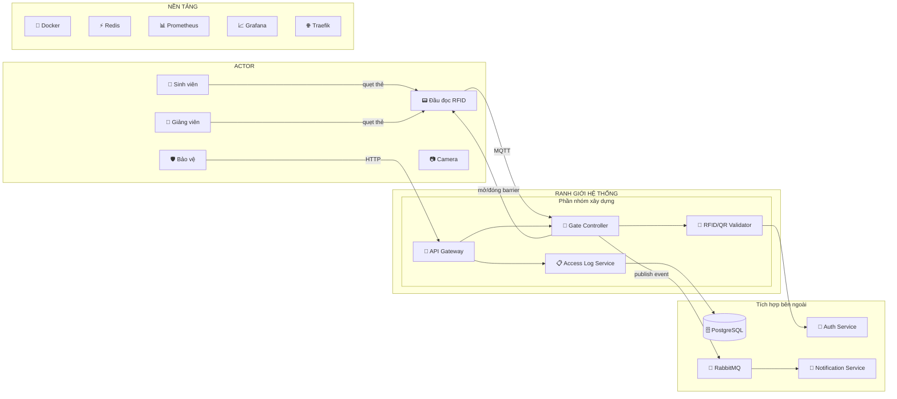

# Service Boundary – Access Gate Service

## 1. Thông tin nhóm

- **Tên nhóm:** Access Gate
- **Lớp:** FIT 4110 – API Platform & Smart Campus
- **Thành viên:**
  - Vũ Đức Nam (vuducnam2005)
  - _(bổ sung thành viên khác tại đây)_
- **Service nhóm phụ trách:** Access Gate Service – Dịch vụ kiểm soát cổng ra vào khuôn viên Smart Campus.
- **Sản phẩm tổng thể của lớp:** Nền tảng Smart Campus – hệ thống quản lý khuôn viên thông minh tích hợp IoT, giám sát, kiểm soát truy cập.

---

## 2. Actor

Ai tương tác với hệ thống/service?

| Actor | Loại | Mô tả |
|---|---|---|
| Sinh viên | Người dùng | Quẹt thẻ / QR code để ra vào cổng campus |
| Giảng viên / Nhân viên | Người dùng | Quẹt thẻ / QR code, có quyền truy cập mở rộng |
| Bảo vệ | Người vận hành | Giám sát cổng, mở cổng thủ công, xem log ra vào |
| Thiết bị IoT | Thiết bị | Đầu đọc RFID, camera, barrier cổng, cảm biến |
| Auth Service | Hệ thống ngoài | Xác thực danh tính người dùng, cấp token |
| Notification Service | Hệ thống ngoài | Nhận sự kiện để gửi cảnh báo truy cập bất thường |

---

## 3. System Boundary

### Ranh giới hệ thống – Nhóm mình xây phần nào?

**Phần nhóm kiểm soát (xây dựng):**

- API quản lý cổng ra vào (mở/đóng/trạng thái)
- API ghi log truy cập (ai, khi nào, cổng nào)
- Xử lý xác thực thẻ RFID / QR code tại cổng
- Quản lý danh sách cổng và thiết bị đầu đọc
- Dashboard giám sát cho bảo vệ (trạng thái cổng, log real-time)

**Phần nhóm chỉ tích hợp (từ bên ngoài):**

- Auth Service – xác thực JWT token, kiểm tra quyền truy cập
- Notification Service – gửi cảnh báo khi có truy cập bất thường
- Database (PostgreSQL) – lưu trữ dữ liệu
- Message Queue (RabbitMQ) – publish sự kiện ra vào
- API Gateway (Traefik) – routing request từ bên ngoài

---

## 4. Service Boundary

### Service của nhóm có trách nhiệm gì?

- Nhận tín hiệu từ đầu đọc RFID / QR scanner tại cổng
- Xác thực quyền truy cập của người dùng (gọi Auth Service)
- Điều khiển barrier cổng (mở / đóng)
- Ghi log đầy đủ mọi lượt ra/vào (thời gian, người, cổng, kết quả)
- Cung cấp API cho bảo vệ tra cứu log, giám sát trạng thái cổng
- Publish sự kiện `gate.entry` / `gate.exit` / `gate.denied` lên RabbitMQ

### Service KHÔNG làm gì?

- ❌ KHÔNG quản lý tài khoản người dùng (thuộc Auth Service)
- ❌ KHÔNG gửi thông báo trực tiếp cho người dùng (thuộc Notification Service)
- ❌ KHÔNG xử lý phân tích dữ liệu / thống kê nâng cao (thuộc Analytics Service)
- ❌ KHÔNG quản lý camera an ninh (thuộc Surveillance Service)

---

## 5. Input / Output

### Input

| Nguồn | Dữ liệu | Giao thức |
|---|---|---|
| Đầu đọc RFID | Mã thẻ RFID của người dùng | MQTT `campus/gate/{gate_id}/rfid` |
| QR Scanner | Dữ liệu QR code | MQTT `campus/gate/{gate_id}/qr` |
| Bảo vệ | Lệnh mở cổng thủ công | HTTP POST `/api/gates/{id}/open` |
| Auth Service | Token xác thực, thông tin quyền | HTTP Response JSON |

### Output

| Đích | Dữ liệu | Giao thức |
|---|---|---|
| Barrier cổng | Lệnh mở/đóng | MQTT `campus/gate/{gate_id}/control` |
| RabbitMQ | Sự kiện `gate.entry`, `gate.exit`, `gate.denied` | AMQP |
| Bảo vệ / Dashboard | Trạng thái cổng, log truy cập | HTTP Response JSON |
| Prometheus | Metrics: số lượt ra vào, tỉ lệ từ chối | HTTP `/metrics` |

---

## 6. API dự kiến

| Method | Endpoint | Mục đích |
|---|---|---|
| GET | `/health` | Kiểm tra service hoạt động |
| GET | `/api/gates` | Lấy danh sách tất cả cổng |
| GET | `/api/gates/{id}` | Chi tiết một cổng (trạng thái, vị trí) |
| POST | `/api/gates/{id}/open` | Mở cổng thủ công (bảo vệ) |
| POST | `/api/gates/{id}/close` | Đóng cổng thủ công |
| GET | `/api/gates/{id}/status` | Trạng thái hiện tại (mở/đóng/lỗi) |
| GET | `/api/access-logs` | Danh sách log ra vào (có phân trang, lọc) |
| GET | `/api/access-logs/{id}` | Chi tiết một lượt ra/vào |
| POST | `/api/access-logs` | Ghi nhận lượt truy cập mới |
| GET | `/api/access-logs/stats` | Thống kê lượt ra vào theo ngày/tuần |
| GET | `/metrics` | Prometheus metrics |

---

## 7. Phụ thuộc service khác

### Service này gọi đến service nào?

| Service | Mục đích | Giao thức |
|---|---|---|
| Auth Service | Xác thực token, kiểm tra quyền truy cập cổng | HTTP REST |
| Notification Service | _(gián tiếp qua RabbitMQ)_ – gửi cảnh báo truy cập bất thường | AMQP |

### Service nào gọi đến service này?

| Service | Mục đích | Giao thức |
|---|---|---|
| Dashboard Service | Hiển thị trạng thái cổng, log truy cập | HTTP REST |
| Analytics Service | Thu thập dữ liệu thống kê lượt ra vào | AMQP subscribe |
| Admin Service | Quản lý cấu hình cổng | HTTP REST |

---

## 8. Sơ đồ minh họa

> **Lưu ý:** Sơ đồ chi tiết hơn được vẽ trên Lucidchart theo mẫu 4 phần: Actor → Boundary → Service → Platform.
