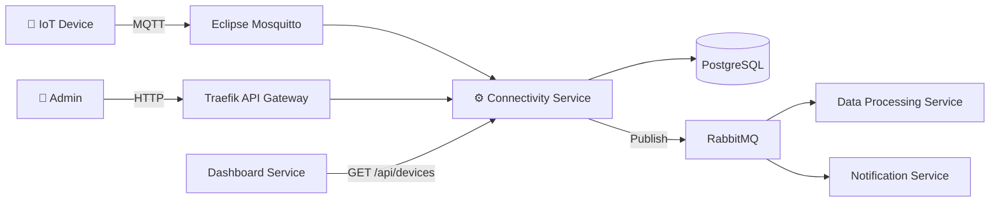

# Service Boundary của nhóm

## 1. Thông tin nhóm

- Tên nhóm: Connectivity Services
- Lớp: FIT 4110 – API Platform & Smart Campus
- Thành viên:
  - Vũ Đức Nam (vuducnam2005)
- Service nhóm phụ trách: **Connectivity Service** – Dịch vụ quản lý kết nối và giao tiếp giữa các thiết bị IoT trong hệ thống Smart Campus.
- Sản phẩm tổng thể của lớp: Nền tảng Smart Campus tích hợp các dịch vụ IoT, giám sát, cảnh báo và quản lý khuôn viên thông minh.

## 2. Actor

Các tác nhân tương tác với hệ thống/service:

- **Thiết bị IoT (IoT Device)**: Gửi dữ liệu cảm biến (nhiệt độ, độ ẩm, chuyển động…) lên hệ thống qua MQTT.
- **Admin hệ thống**: Quản lý cấu hình kết nối, theo dõi trạng thái thiết bị, xem log kết nối.
- **Service khác trong hệ thống**: Gọi API để lấy trạng thái kết nối thiết bị, đăng ký nhận sự kiện.

## 3. System Boundary

Nhóm em xây phần **Connectivity Service** – chịu trách nhiệm quản lý việc kết nối giữa các thiết bị IoT và nền tảng Smart Campus.

**Phần nhóm kiểm soát:**

- API quản lý thiết bị kết nối (CRUD thông tin thiết bị)
- MQTT Broker integration (nhận message từ thiết bị qua Eclipse Mosquitto)
- Message Queue integration (phân phối sự kiện qua RabbitMQ)
- Health check & trạng thái kết nối thiết bị

**Phần nhóm chỉ tích hợp:**

- Database (PostgreSQL) – lưu trữ thông tin thiết bị và log kết nối
- Monitoring (Prometheus + Grafana) – expose metrics để hệ thống giám sát chung thu thập
- API Gateway (Traefik) – routing request từ bên ngoài vào service

## 4. Service Boundary

**Service của nhóm có trách nhiệm:**

- Nhận và xác thực kết nối từ thiết bị IoT
- Quản lý danh sách thiết bị đã đăng ký
- Chuyển tiếp message từ MQTT sang Message Queue (RabbitMQ) để các service khác xử lý
- Cung cấp API truy vấn trạng thái kết nối (online/offline) của thiết bị
- Ghi log kết nối và ngắt kết nối

**Service KHÔNG làm:**

- Không xử lý logic nghiệp vụ của dữ liệu cảm biến (việc này thuộc Data Processing Service)
- Không hiển thị giao diện người dùng (việc này thuộc Frontend/Dashboard Service)
- Không quản lý người dùng hoặc xác thực tài khoản (việc này thuộc Auth Service)

## 5. Input / Output

### Input

- Dữ liệu MQTT từ thiết bị IoT (topic: `campus/devices/{device_id}/data`)
- HTTP request đăng ký thiết bị mới (POST /api/devices)
- HTTP request truy vấn trạng thái kết nối (GET /api/devices/{id}/status)

### Output

- Message đẩy vào RabbitMQ queue (`device.data.received`, `device.connected`, `device.disconnected`)
- HTTP response JSON chứa thông tin thiết bị và trạng thái kết nối
- Prometheus metrics (`connectivity_devices_online`, `connectivity_messages_total`)

## 6. API dự kiến

| Method | Endpoint | Mục đích |
|---|---|---|
| GET | /health | Kiểm tra service còn hoạt động |
| GET | /api/devices | Lấy danh sách thiết bị đã đăng ký |
| GET | /api/devices/{id} | Lấy chi tiết một thiết bị |
| GET | /api/devices/{id}/status | Kiểm tra trạng thái kết nối (online/offline) |
| POST | /api/devices | Đăng ký thiết bị mới |
| PUT | /api/devices/{id} | Cập nhật thông tin thiết bị |
| DELETE | /api/devices/{id} | Xóa thiết bị khỏi hệ thống |
| GET | /metrics | Expose Prometheus metrics |

## 7. Phụ thuộc service khác

**Service này gọi đến service nào?**

- Không gọi trực tiếp đến service nào. Giao tiếp gián tiếp qua RabbitMQ (publish message).

**Service nào gọi đến service này?**

- **Data Processing Service**: subscribe queue `device.data.received` để xử lý dữ liệu cảm biến.
- **Notification Service**: subscribe queue `device.disconnected` để gửi cảnh báo mất kết nối.
- **Dashboard Service**: gọi API `GET /api/devices` và `GET /api/devices/{id}/status` để hiển thị trạng thái.

## 8. Sơ đồ minh họa

